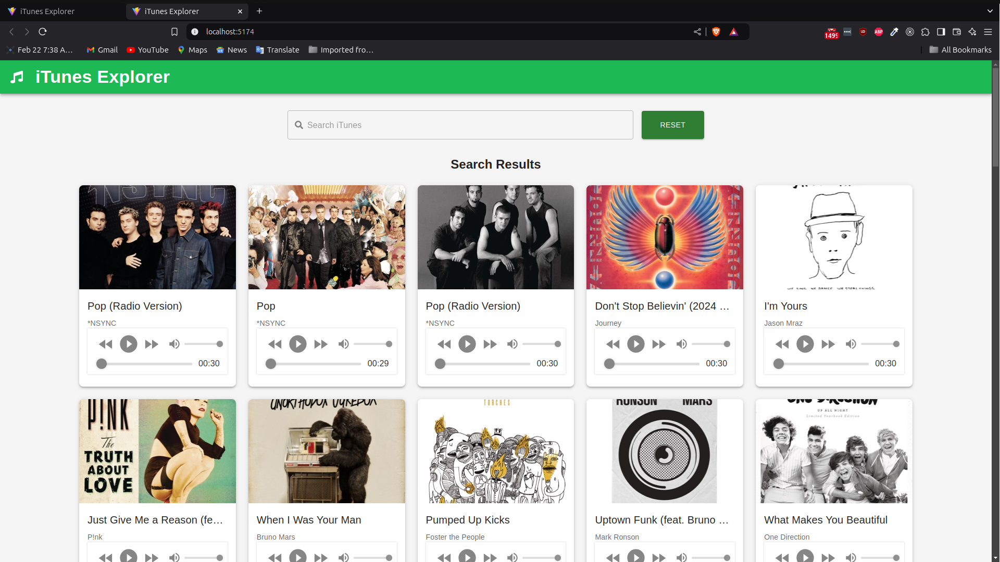

# iTunes Explorer 🎶

iTunes Explorer is a React-based application that allows users to search for music tracks, albums, and artists from the iTunes database using the iTunes Search API. Built with Vite, it delivers lightning-fast loading speeds and a smooth development experience.

## 📌 Table of Contents

- [iTunes Explorer 🎶](#itunes-explorer-)
  - [📌 Table of Contents](#-table-of-contents)
  - [✨ Features](#-features)
  - [🎥 Demo](#-demo)
  - [🚀 Installation](#-installation)
    - [Prerequisites](#prerequisites)
    - [Steps](#steps)
    - [📖 Usage](#-usage)
  - [🛠️ Technologies Used](#️-technologies-used)
  - [🤝 Contributing](#-contributing)
  - [📄 License](#-license)

## ✨ Features

- **Search for Songs, Albums, and Artists**: Find music from a vast iTunes library.
- **Real-Time Results**: Display search results as you type.
- **Responsive Design**: Optimized for both desktop and mobile devices.

## 🎥 Demo


_Explore the iTunes library with ease!_ <!-- Replace the path with the correct location of your image -->

## 🚀 Installation

To run this project locally, follow these steps.

### Prerequisites

Make sure you have [Node.js](https://nodejs.org/) and [Git](https://git-scm.com/) installed.

### Steps

1. **Clone the Repository**

```bash
   git clone https://github.com/yourusername/itunes.git
   cd itunes-explorer
```

Install Dependencies

```bash
npm install
```

Start the Development Server

```bash
npm run dev
```

Building for Production

```bash
npm run build
```

To preview the production build locally:

```bash
npm run serve
```

### 📖 Usage

Enter a search term in the search bar to look up songs, albums, or artists.
Click on a result to view more details about the selected item.

## 🛠️ Technologies Used

- **React**: JavaScript library for building user interfaces
- **Vite**: Fast build tool for frontend development
- **iTunes Search API**: API to fetch music data
- **Semantic UI**: UI components for consistent styling

## 🤝 Contributing

We welcome contributions! To contribute:

1. **Fork the repository**
2. **Create a new branch for your feature**

   ```bash
    git checkout -b feature-name
   ```

3. **Commit your changes**

   ```bash
   git commit -m 'Add some feature'
   ```

4. **Push to the branch**

   ```bash
   git push origin feature-name
   ```

5. **Create a pull request**

## 📄 License
